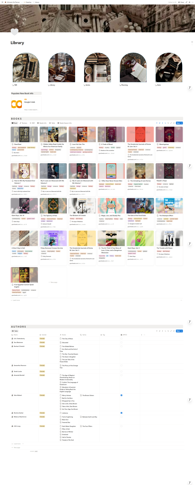
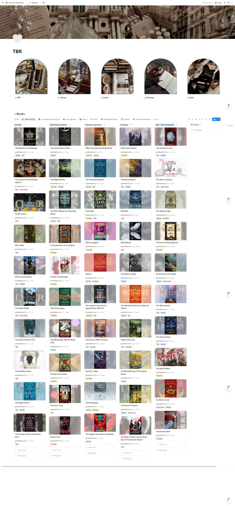
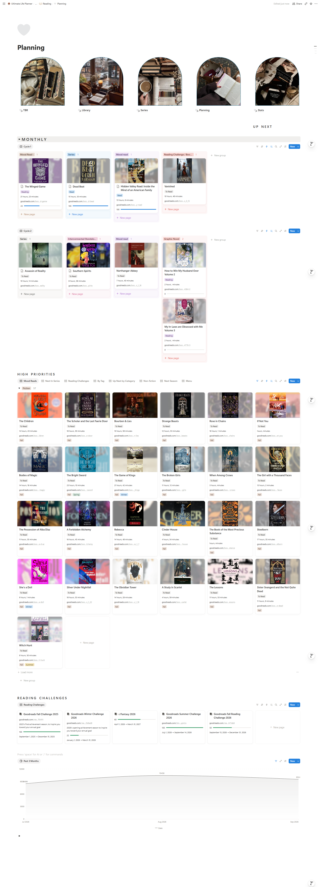
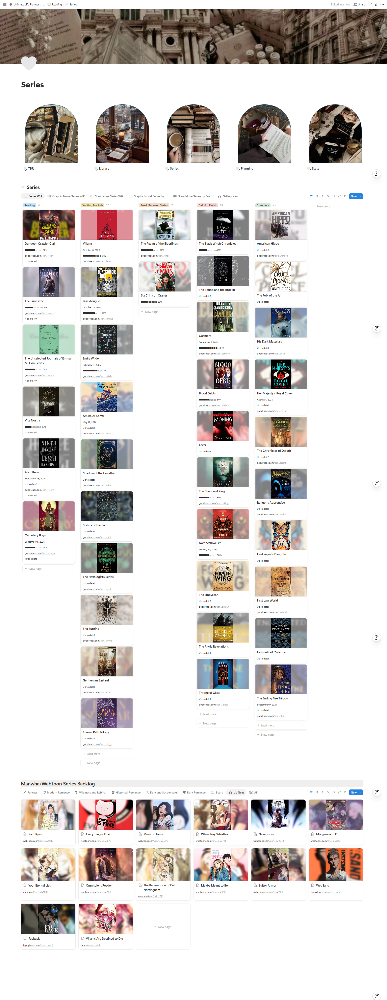
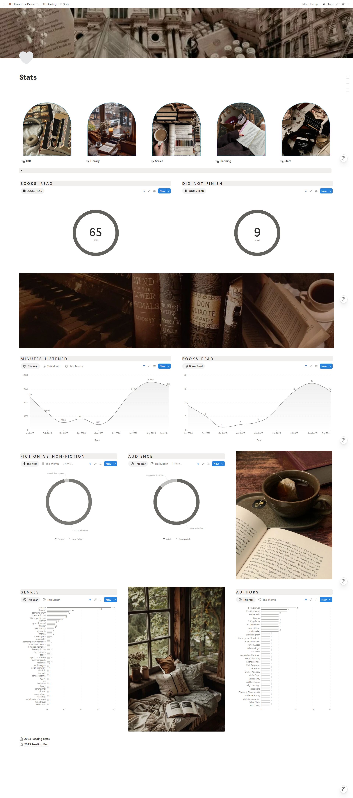

# 📚 Notion Books

A custom reading management and analytics system built with **Notion and Python** to manage my TBR, plan what to read next, automatically track reading activity, and analyze my reading over time.

> This project combines a relational Notion workspace, native Notion automations, Python-based metadata enrichment, and custom dashboards into a single reading system.

<p align="center">
  
</p>

## Overview

I originally built this system because I wanted more control over my reading data than a traditional book-tracking app could provide.

Over time, it evolved into a connected system for:

- managing a large TBR
- organizing books by priority, season, series, and other metadata
- planning what to read without committing to one rigid planning method
- tracking reading progress with minimal manual data entry
- supporting rereads without duplicating book records
- managing series and reading challenges
- analyzing reading habits through custom dashboards

The system is designed around a simple idea: **automate repetitive data work while keeping subjective decisions flexible and manual.**

## 🔄 System at a Glance

The overall book lifecycle looks like this:

```text
Goodreads
    ↓
Capture
    ↓
Enrich
    ↓
Plan
    ↓
Read
    ↓
Track
    ↓
Analyze
```

Books begin on my Goodreads Want to Read shelf, move through an enrichment workflow in Notion and Python, and eventually feed into planning, reading activity, and analytics.

---

## 📖 Library & Metadata Management

<p align="center">
  
</p>

The **Library** page acts as the administrative side of the system.

I periodically batch-add books from my Goodreads Want to Read shelf using the Notion browser extension. New records initially contain the Goodreads URL but still require additional information.

These books appear in a **Needs Info** view until the setup process is complete.

### Book enrichment workflow

```text
Goodreads Want to Read
        ↓
Notion Browser Extension
        ↓
Library → Needs Info
        ↓
Google Colab / Python
        ↓
Goodreads metadata enrichment
        ↓
Manual cover + reading season
        ↓
Status → To Read
        ↓
Ready for planning
```

A Python notebook running in Google Colab uses each Goodreads URL to retrieve and normalize metadata including:

- title
- author
- publication date
- genres
- audience
- fiction/nonfiction classification

Authors are matched against the existing Authors database and automatically created when necessary.

I manually handle information where automation would be less useful, such as choosing the best season to read a book and preparing the cover image used in my Notion interface.

Changing the final status to **To Read** indicates that setup is complete and removes the book from the Needs Info workflow.

---

## 🗂️ TBR & Flexible Reading Planning

<p align="center">
  
</p>

The TBR uses structured metadata to make a large collection of unread books easier to navigate.

Books can be browsed using information such as genre, priority, season, and series. Priority levels help narrow the collection into groups ranging from books I want to read soon to books I may eventually reconsider.

<p align="center">
  
</p>

The **Planning** page is intentionally more flexible.

My approach to choosing books changes frequently, so I designed the underlying data model to remain stable while allowing the planning interface to evolve.

My current approach uses reading rotations. High-priority views provide pools of potential books, which I can drag into different reading cycles to plan what comes next.

This separates **data management from planning methodology**: I can change how I plan without redesigning the underlying library.

---

## 🎧 Automated Reading Tracking

Once I choose a book, I manually enter its audiobook runtime and change its status from **To Read** to **Reading**.

From there, most of the tracking is automated.

Changing the status to Reading automatically:

1. creates a new Reading Session
2. creates a `Started` Reading Log at 0%
3. links the active session to the book
4. initializes the book's current progress state

While reading, the main value I update manually is simply the book's **progress percentage**.

The system uses the change in percentage and the audiobook's total runtime to estimate how many minutes were consumed:

```text
Change in Progress × Total Audiobook Runtime
                  =
        Estimated Minutes Listened
```

For example, moving from 30% to 42% represents approximately 12% of the audiobook's total runtime.

Each progress update creates a dated Reading Log containing the new percentage and calculated listening time.

When the book's status changes to **Read**, another automation records the remaining listening time, creates the final `Finished` log, sets progress to 100%, and clears the active reading state.

This gives me detailed reading-history data without requiring me to manually start timers or record individual listening sessions.

---

## 🔁 Reread Support

Although I don't reread frequently, I wanted the data model to support it without requiring duplicate book records.

Each time a book moves into Reading, the system creates a new **Reading Session**.

```text
Book
├── Reading Session #1
│   ├── Started
│   ├── Reached 25%
│   ├── Reached 60%
│   └── Finished
│
└── Reading Session #2
    ├── Started
    ├── Reached 40%
    └── ...
```

Reading Logs belong to their individual Reading Session, while both sessions remain connected to the same Book.

This preserves separate reading histories while maintaining one canonical record for the book itself.

---

## 📚 Series Management

<p align="center">
  
</p>

The **Series** database provides another layer of organization on top of individual books.

It tracks information including:

- books belonging to each series
- reading progress
- publication status
- upcoming books
- author relationships
- series type

Series can also contain **parent and sub-series relationships**, allowing larger fictional universes or nested series to be represented without flattening them into unrelated records.

Progress is calculated from the books connected to the series and distinguishes between a fully completed series, an ongoing series that is currently up to date, and a partially completed series.

The Series area also includes a separate planning interface for my manhwa and webtoon backlog.

---

## 🏆 Reading Challenges

Reading challenges are modeled using two connected databases: **Reading Challenges** and **Prompts**.

A challenge contains its active date range and related prompts. Individual prompts can then be connected to one or more possible books, including a preferred book when I already know what I would like to use.

Prompt status is calculated automatically from the underlying reading data.

Rather than simply marking a prompt complete manually, the system checks whether a connected book was actually completed **within the challenge's date range**.

Prompts can therefore move automatically between states such as:

- Not Started
- In Progress
- Completed
- Not Completed

Challenge completion percentage is then calculated from the statuses of its prompts.

---

## 📊 Reading Analytics

<p align="center">
  
</p>

Because reading activity is stored as structured data, the same system can also generate personalized analytics.

The **Stats** dashboard currently includes views such as:

- books read
- books not finished
- minutes listened
- books completed over time
- fiction vs. nonfiction
- audience
- genres
- authors

The dashboard is built from the same underlying data used for everyday reading management, allowing tracking and analysis to happen within one connected system.

---

## 🤖 Python Automation

The current Python automation runs through a Google Colab notebook so it can be used without depending on a specific local computer.

The notebook:

1. identifies Notion book records that still need metadata
2. validates the stored Goodreads URL
3. loads the Goodreads page using Selenium
4. parses metadata with BeautifulSoup
5. normalizes selected Goodreads categories for my Notion schema
6. checks whether each author already exists
7. creates missing author records when necessary
8. updates the existing book record through the Notion API

One example of normalization is consolidating Goodreads labels such as `Graphic Novels`, `Comics`, and `Graphic Novels Comics` into the single `graphic novel` genre used by my library.

API credentials are stored using **Google Colab Secrets** rather than inside the notebook.

➡️ See [`automation/populate_new_books.ipynb`](automation/populate_new_books.ipynb)

---

## 🏗️ System Architecture

The workspace is built around several connected Notion databases:

```text
Books
├── Authors
├── Series
├── Reading Sessions
│   └── Reading Logs
└── Prompts
    └── Reading Challenges
```

**Books** acts as the central record for each title.

**Authors** provides reusable author records rather than storing authors as plain text.

**Series** organizes books into series and supports nested parent/sub-series relationships.

**Reading Sessions** represents an individual read-through of a book.

**Reading Logs** stores reading events such as starting, reaching a new percentage, finishing, or abandoning a book.

**Reading Challenges** stores challenge-level information and dates.

**Prompts** connects challenge requirements to potential books and calculates completion from actual reading activity.

For a deeper look at the database relationships, formulas, and automation design, see [`docs/architecture.md`](docs/architecture.md).

---

## 🛠️ Tech Stack

**Notion** — relational databases, dashboards, formulas, views, and workflow automations  
**Python** — metadata processing and integration logic  
**Notion API** — reading and updating database records  
**Selenium** — browser automation for dynamically loaded Goodreads pages  
**BeautifulSoup** — HTML parsing and metadata extraction  
**Google Colab** — cloud-based execution environment  
**Goodreads** — source for my TBR and book metadata

---

## 💡 Design Principles

A few principles have shaped the system as it has evolved:

**Minimize repetitive input.** Progress percentage is enough to generate detailed listening data without manually logging time.

**Automate objective data, not subjective decisions.** Metadata can be collected programmatically; priorities, seasonal fit, and reading plans remain under manual control.

**Separate data from presentation.** The underlying databases remain stable even when I redesign dashboards or change how I plan my reading.

**Preserve history.** Reading Sessions and Reading Logs maintain historical activity instead of overwriting previous reads.

**Build for actual use.** The system has changed repeatedly as my reading habits have changed, rather than being designed around a fixed workflow that I have to follow.


## 📖 Technical Documentation

For a deeper look at the system:

- [System Architecture](docs/architecture.md) — Database structure and relationships
- [Reading Activity & Automation](docs/reading-tracking.md) — Sessions, logs, progress tracking, rereads, and Notion automations
- [Metadata Automation](docs/metadata-automation.md) — Goodreads scraping, metadata normalization, and Notion API integration
- [Reading Challenges](docs/challenges.md) — Date-aware prompt and challenge tracking