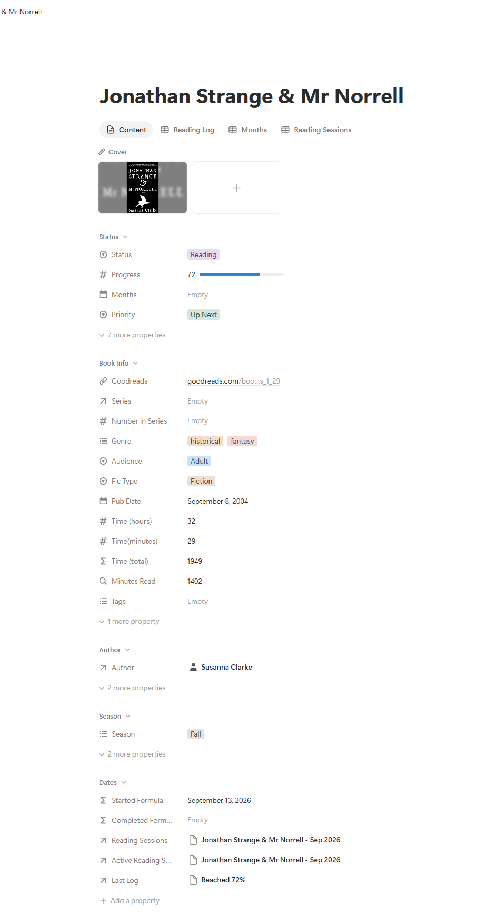

# System Architecture

The Notion Books system is built around seven connected Notion databases. Each database has a distinct responsibility, separating permanent book information from reading activity, series management, and reading challenges.

This structure allows the same underlying data to support multiple workflows and dashboards without duplicating information.

## Database Relationships

```text
                         ┌─────────────┐
                         │   Authors   │
                         └──────┬──────┘
                                │
                                ▼
┌──────────┐             ┌─────────────┐             ┌─────────────┐
│  Series  │◄───────────►│    Books    │◄───────────►│   Prompts   │
└──────────┘             └──────┬──────┘             └──────┬──────┘
                                │                            │
                                ▼                            ▼
                       ┌─────────────────┐          ┌──────────────────┐
                       │ Reading Sessions│          │Reading Challenges│
                       └────────┬────────┘          └──────────────────┘
                                │
                                ▼
                         ┌─────────────┐
                         │ Reading Log │
                         └─────────────┘
```

**Books** acts as the central record for each title, with the surrounding databases providing additional structure and historical data.

### Detailed Database Schema

For a more technical view, the complete entity relationship diagram (ERD)
documents all seven databases, their properties, and relationship cardinalities.

[**View the detailed ERD**](images/notion-database-erd.svg) | [View DBML source](notion-schema.dbml)

The ERD represents the logical structure of the Notion system. Formula and
rollup properties are documented using their resulting data types and
descriptive notes, since DBML does not natively support Notion-specific
property types.

---

## Core Databases

### 📚 Books

The central database contains one canonical record for each book.

In addition to book metadata, it stores the book's current reading state and connects it to authors, series, reading activity, and challenge prompts.

Key information includes:

- title and Goodreads URL
- author and series relationships
- genre, audience, and fiction type
- publication date
- priority and preferred reading season
- audiobook runtime
- reading status and current progress

Several additional properties use formulas, relations, and rollups to derive information from the connected databases rather than requiring duplicate manual entry.

<p align="center">
  
</p>

### ✍️ Authors

Authors are maintained as individual records and related to Books.

This allows multiple books to share the same Author record and provides consistent author data for views and analytics.

The Python metadata workflow automatically matches scraped authors to existing records or creates a new Author when necessary.

### 📖 Series

Series provides a separate layer for tracking reading progress across connected books.

In addition to its Books relationship, the database tracks information such as series type, reading status, upcoming publications, and calculated progress.

Series can also relate to other Series through **Parent Series** and **Sub Series** relationships, allowing nested series and larger collections to be represented.

### 🕒 Reading Sessions

A Reading Session represents a single read-through of a Book.

Creating reading activity at the session level allows multiple reads of the same Book to remain separate without creating duplicate Book records.

A new Reading Session is automatically created whenever a Book enters `Reading`.

### 📝 Reading Log

Reading Logs represent individual events within a Reading Session, including:

```text
Started
Reached 25%
Reached 60%
Finished
```

Each log stores the associated Book, Reading Session, date, percentage complete, and calculated listening time.

Together, Reading Sessions and Reading Logs preserve reading history while the Book record maintains the current state.

➡️ See [Reading Activity & Automation](reading-lifecycle.md) for the full tracking and automation workflow.

### 🏆 Reading Challenges

Reading Challenges represent individual challenges and store information such as the challenge's date range and overall completion.

Each challenge connects to its individual requirements through the Prompts database.

### 🎯 Prompts

Prompts represent the individual requirements within Reading Challenges.

Each Prompt can be related to multiple potential Books as well as a preferred `Top Book Pick`.

Prompt status is calculated using the connected Books and the challenge's active dates, allowing completion to be based on actual reading activity rather than a manually maintained checkbox.

➡️ See [Reading Challenges](challenges.md) for the full challenge-tracking logic.

---

## External Metadata Layer

Book metadata enrichment happens outside Notion through a Python notebook running in Google Colab.

```text
Goodreads
    ↓
Python / Google Colab
    ↓
Selenium + BeautifulSoup
    ↓
Metadata normalization
    ↓
Notion API
    ↓
Books + Authors
```

This keeps repetitive external-data collection separate from the reading workflows managed inside Notion.

➡️ See [Metadata Automation](goodreads-integration.md) for the enrichment workflow and [`../automation/populate_new_books.ipynb`](../automation/populate_new_books.ipynb) for the implementation.

---

## Architecture Principles

### One canonical Book record

Book metadata lives on a single record rather than creating new Books for different workflows or rereads.

### Separate current state from history

Books maintain the current reading state, while Reading Sessions and Reading Logs preserve historical activity.

### Derive rather than duplicate

Relations, rollups, formulas, and automations derive information such as reading time, completion dates, series progress, and challenge progress from existing data wherever possible. Calculated properties are documented in the database schema alongside their underlying data types, distinguishing formulas and rollups from manually maintained information.

### Keep workflows flexible

The structured data model remains stable even when planning methods, dashboards, or views change.

This separation allows the system to evolve without rebuilding the underlying data architecture.