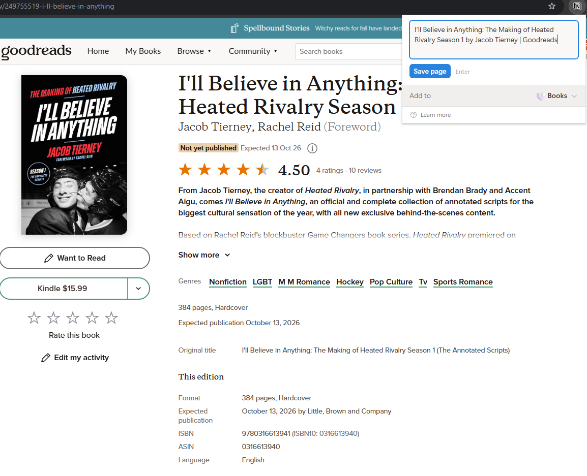
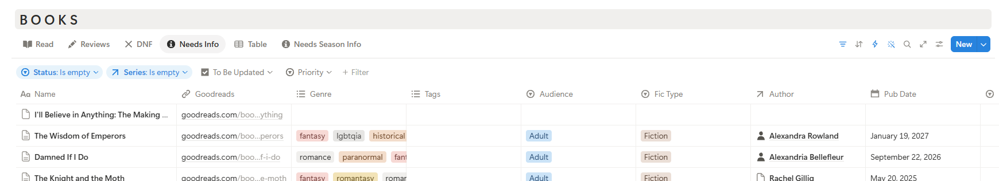
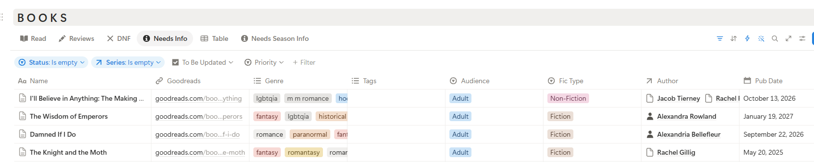

# Goodreads Integration

Adding a book to my Notion library begins with very little structured information. I save books to Goodreads as I discover them, then use the Notion browser extension to create a Book record containing the Goodreads URL.

<p align="center">
  
</p>

Rather than manually copying metadata for every book, I built a Python workflow in Google Colab that uses the Goodreads URL to retrieve, normalize, and add the relevant metadata to my Notion library.

This approach automates repetitive data entry while leaving subjective decisions such as when I want to read a book or how I want it presented in my library under manual control.

---

## The Problem

My Notion system relies on structured book metadata for filtering, planning, and analytics. Manually entering that information for every book would require repeatedly copying the same types of data from Goodreads.

The initial Book record therefore only needs a Goodreads URL. The Python workflow uses that URL as the source for the remaining metadata.



The current integration retrieves:

- title
- author(s)
- publication date
- genres
- audience
- fiction/nonfiction classification



Once the automated enrichment is complete, I manually add the cover treatment I want for the Notion interface and assign a preferred reading season.

---

## Finding Books That Need Metadata

The notebook is designed to process books in batches rather than requiring me to run it for one specific title.

It queries the Notion Books database for records where `Audience` is empty. In my workflow, this acts as an indicator that the book has not yet gone through metadata enrichment.

```text
Books Database
      ↓
Audience is empty?
      ↓
Needs metadata
      ↓
Add to processing batch
```

For each matching Book, the notebook retrieves its Goodreads URL and validates it before attempting to process the page.

This allows me to periodically add several books to Notion and enrich all outstanding records in a single run.

---

## Loading Goodreads

Goodreads pages are loaded using **Selenium** with a headless Chrome browser running in Google Colab.

Rather than immediately attempting to parse the returned page, the workflow waits for the Goodreads book-title element to appear. Once the page has loaded, its HTML is passed to **BeautifulSoup** for parsing.

```text
Goodreads URL
      ↓
Selenium / Chrome
      ↓
Wait for book content
      ↓
Retrieve page HTML
      ↓
BeautifulSoup
```

Separating browser loading from HTML parsing allows Selenium to handle the webpage while BeautifulSoup handles extraction of the book data.

---

## Extracting Book Metadata

The scraper locates the relevant Goodreads page elements and builds a structured representation of the book.

The resulting Python object contains the values needed by the Notion Books database:

```text
Book
├── Name
├── Goodreads URL
├── Authors
├── Publication Date
├── Genres
├── Audience
└── Fiction Type
```

Publication dates are parsed into a consistent date value before being sent to Notion.

Authors are collected as a list, allowing books with multiple authors to retain those relationships.

---

## Normalizing Goodreads Data

The Goodreads categories do not map directly to the way I organize books in Notion, so scraped values go through a normalization step before they are saved.

For example, several Goodreads labels are consolidated into the categories used by my library:

```text
Graphic Novels
Comics
Graphic Novels Comics
        ↓
graphic novel
```

Other examples include:

```text
LGBT / Queer → lgbtqia

Lesbian → sapphic

Nonfiction → Fic Type: Non-Fiction
```

Audience labels are separated from genres and stored in the dedicated `Audience` property:

```text
Adult
Young Adult
Middle Grade
Children
```

The workflow also excludes Goodreads categories that are either redundant or not useful for the way I organize my library, such as combinations of genres that are already represented by more useful individual categories.

This normalization layer means Goodreads acts as the source of the metadata without dictating the structure of my own data model.

---

## Managing Authors

Authors are stored in their own Notion database rather than as plain text on each Book.

Before updating a Book, the workflow searches the Authors database for each scraped author.

```text
Scraped Author
      ↓
Search Authors database
      ↓
   Author exists?
    ↙        ↘
  Yes         No
   ↓           ↓
Use record   Create Author
    \         /
     \       /
      ▼     ▼
   Relate to Book
```

If the Author already exists, the existing Notion record is reused. If no matching record exists, the integration creates one and uses the new record in the Book's Author relation.

This prevents the metadata workflow from creating duplicate Author records each time another book by the same author is added.

---

## Updating Notion

After the Goodreads data has been extracted and normalized, the notebook converts it into the property structure expected by the Notion API.

The existing Book record is then updated rather than replaced.

```text
Scraped Goodreads Data
          ↓
Normalized Python Data
          ↓
Notion Property Structure
          ↓
PATCH existing Book
```

This preserves the original Book record and its relationships while filling in the missing metadata.

The notebook uses reusable API helper functions for:

- querying Notion databases
- creating pages
- updating pages

Authentication is handled through a `NOTION_TOKEN` stored in **Google Colab Secrets**, keeping the integration token out of the notebook and GitHub repository.

---

## Batch Processing and Error Handling

The workflow is intended to process multiple books during the same run.

Each Book is processed independently. If a Goodreads URL is missing or invalid, the record is skipped. If an error occurs while processing one Book, the error is reported without stopping the rest of the batch.

Progress messages are printed throughout the run so I can see which Book is being processed, whether its Author already exists, when Goodreads has loaded, and whether the Notion update succeeds.

```text
Find books needing metadata
          ↓
      Process Book
          ↓
    ┌──── Success ────┐
    │                 │
Update Notion     Continue batch
    │
    └─────────────────►

If processing fails:
          ↓
    Report error
          ↓
    Continue batch
```

This makes the notebook practical as an interactive maintenance tool rather than requiring every source record to be perfect before a batch can run.

---

## Manual vs. Automated Work

The integration intentionally does not automate every part of adding a Book.

### Automated

The Python workflow handles:

- finding Books that need enrichment
- loading Goodreads pages
- extracting metadata
- normalizing categories
- matching and creating Authors
- formatting data for Notion
- updating existing Book records

### Manual

I retain control over:

- deciding which books enter my library
- capturing the initial Goodreads URL
- preparing the cover image used in Notion
- assigning preferred reading season
- changing the Book to `To Read` once preparation is complete

This keeps repetitive metadata work automated without forcing subjective organizational choices into code.

---

## Technology

The integration uses:

**Python** for the overall workflow and transformation logic  
**Google Colab** as the execution environment  
**Selenium** and **Chrome** for loading Goodreads pages  
**BeautifulSoup** for parsing book metadata  
**Requests** for communication with the Notion API  
**Notion API** for querying, creating, and updating records  
**Google Colab Secrets** for API credential management

The implementation is available in [`../automation/populate_new_books.ipynb`](../automation/populate_new_books.ipynb).

---

## Design Decisions

### Enrich existing records rather than create duplicates

The browser extension provides a quick capture mechanism. Python enriches that same Book record rather than creating another copy.

### Separate external data from personal organization

Goodreads provides source metadata, but normalization converts it into the categories that make sense for my own system.

### Maintain relational data

Authors are matched against a dedicated Authors database so Books connect to reusable records rather than storing author names as isolated text.

### Support batch maintenance

The notebook processes all Books currently needing metadata, making it useful as a periodic library-maintenance workflow rather than a one-book-at-a-time script.

### Fail independently

An invalid or problematic Book should not prevent the remaining Books in the batch from being processed.

### Automate repetition, not preference

Objective metadata collection is automated while subjective decisions about prioritization, season, and presentation remain manual.