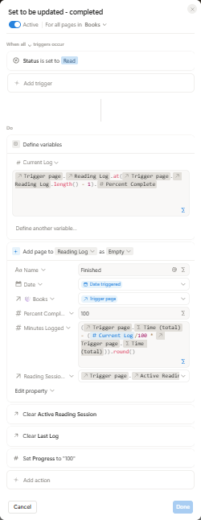
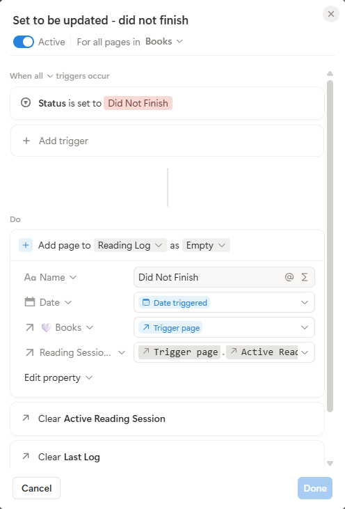

## Reading Lifecycle

The reading workflow uses four Notion automations that respond to changes I make on the Book record. Rather than manually creating Reading Sessions or Reading Logs, I update the book's **Status** and **Progress**, and those changes trigger the appropriate automation.

<table>
<tr>
<td width="70%" valign="top">

<h3>Starting a Reading Session</h3>

<p>When I change a Book's Status to <code>Reading</code>, the start automation initializes everything needed to track that read.</p>

<p>It creates a new Reading Session and connects it to the Book. That session is also stored as the Book's <code>Active Reading Session</code>, which gives later automations a way to identify where new activity should be recorded.</p>

<p>The automation then creates the first Reading Log with a <code>Started</code> event at 0% progress. That log becomes the Book's <code>Last Log</code>, and the Book's Progress is set to 0%.</p>

<p>At this point, the system has established both pieces of temporary state it needs while I read:</p>

<ul>
<li><code>Active Reading Session</code> identifies the current read-through.</li>
<li><code>Last Log</code> identifies the most recently recorded progress point.</li>
</ul>

</td>
<td width="30%" valign="top" align="center">
<a href="images/automations-started.png">

</a>
</td>
</tr>
</table>

<table>
<tr>
<td width="70%" valign="top">

<h3>Recording Progress</h3>

<p>While I am reading, I manually update the Book's Progress percentage.</p>

<p>Each change triggers the progress automation. The automation uses <code>Last Log</code> to retrieve the previous percentage and compares it with the new Progress value to determine how much of the book I have read since the previous update.</p>

<p>For an audiobook, that percentage difference is multiplied by the Book's total runtime:</p>

<pre>(Current Progress - Previous Progress)
            × Total Runtime
                    =
     Estimated Minutes Listened</pre>

<p>The automation creates a new Reading Log containing the current percentage, calculated minutes, date, Book, and <code>Active Reading Session</code>.</p>

<p>After the log is created, it replaces the previous <code>Last Log</code>. This means the next Progress update can use the newly recorded percentage as its starting point.</p>

<p>The process repeats each time I update Progress.</p>

</td>
<td width="30%" valign="top" align="center">
<a href="images/automation-update-percentage.png">

</a>
</td>
</tr>
</table>

<table>
<tr>
<td width="70%" valign="top">

<h3>Completing a Reading Session</h3>

<p>When I finish a book, I change its Status to <code>Read</code>.</p>

<p>Because I may not have manually updated Progress to exactly 100% before finishing, the completion automation uses the last recorded percentage to calculate the remaining portion of the audiobook.</p>

<p>It creates a final <code>Finished</code> Reading Log at 100% and records the remaining listening time. The Book's Progress is then set to 100%.</p>

<p>Finally, <code>Active Reading Session</code> and <code>Last Log</code> are cleared. These properties are no longer needed because there is no active read, but the Reading Session and all of its Reading Logs remain as permanent historical records.</p>

</td>
<td width="30%" valign="top" align="center">
<a href="images/automation-completed.png">

</a>
</td>
</tr>
</table>

<table>
<tr>
<td width="70%" valign="top">

<h3>Ending a Book Without Finishing</h3>

<p>Changing Status to <code>Did Not Finish</code> triggers a separate automation.</p>

<p>A <code>Did Not Finish</code> Reading Log is created and connected to the Book's current Reading Session.</p>

<p>The automation then clears <code>Active Reading Session</code> and <code>Last Log</code>, ending the active workflow while preserving the Reading Session and all activity recorded before the book was abandoned.</p>

</td>
<td width="30%" valign="top" align="center">
<a href="images/automation-dnf.png">

</a>
</td>
</tr>
</table>

### The Complete Flow

The four automations work together as a lifecycle:

```text
MANUAL                          AUTOMATED

Status → Reading ────────────► Create Reading Session
                               Create Started Log
                               Set Active Reading Session
                               Set Last Log
                               Set Progress → 0%

Progress → New % ────────────► Retrieve previous %
                               Calculate progress delta
                               Calculate minutes listened
                               Create Reading Log
                               Replace Last Log

       [repeat progress updates while reading]

Status → Read ───────────────► Calculate remaining minutes
                               Create Finished Log
                               Set Progress → 100%
                               Clear active state

             OR

Status → Did Not Finish ─────► Create DNF Log
                               Clear active state

                                      ↓
                              Reading Session + Logs
                               remain as history
```

This design keeps the interaction with the system simple: I control **what I'm reading and how far I've progressed**, while the automations handle the activity records, calculations, relationships, and workflow state required behind the scenes.