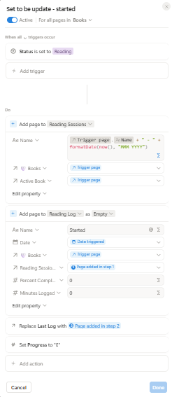
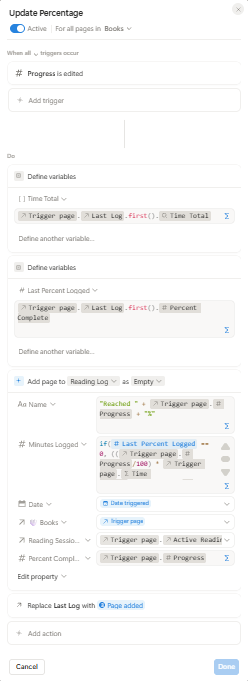
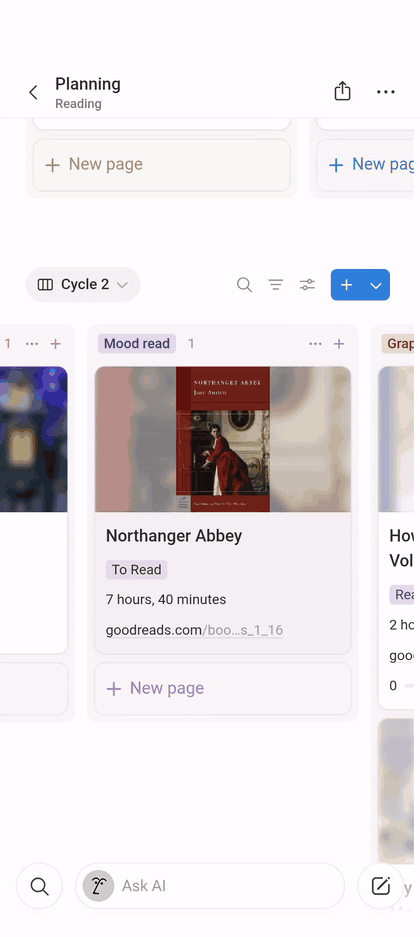
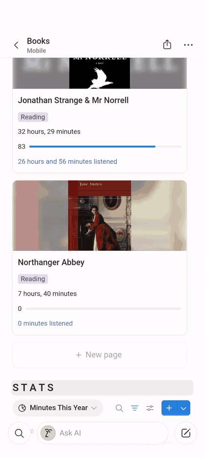

## Reading Lifecycle

The reading workflow uses four Notion automations that respond to changes I make on the Book record. Rather than manually creating Reading Sessions or Reading Logs, I update the book's **Status** and **Progress**, and those changes trigger the appropriate automation.

<table>
<tr>
<td width="70%" valign="top">

<h3>Starting a Reading Session</h3>

When I change a Book's Status to <code>Reading</code>, the start automation initializes everything needed to track that read.

It creates a new Reading Session and connects it to the Book. That session is also stored as the Book's <code>Active Reading Session</code>, which gives later automations a way to identify where new activity should be recorded.

The automation then creates the first Reading Log with a <code>Started</code> event at 0% progress. That log becomes the Book's <code>Last Log</code>, and the Book's Progress is set to 0%.

At this point, the system has established both pieces of temporary state it needs while I read:

<ul>
<li><code>Active Reading Session</code> identifies the current read-through.</li>
<li><code>Last Log</code> identifies the most recently recorded progress point.</li>
</ul>

</td>
<td width="30%" valign="top" align="center">

</td>
</tr>
</table>

<table>
<tr>
<td width="70%" valign="top">

<h3>Recording Progress</h3>

While I am reading, I manually update the Book's Progress percentage.

Each change triggers the progress automation. The automation uses <code>Last Log</code> to retrieve the previous percentage and compares it with the new Progress value to determine how much of the book I have read since the previous update.

For an audiobook, that percentage difference is multiplied by the Book's total runtime:

<pre>(Current Progress - Previous Progress)
            × Total Runtime
                   =
     Estimated Minutes Listened</pre>

The automation creates a new Reading Log containing the current percentage, calculated minutes, date, Book, and <code>Active Reading Session</code>.

After the log is created, it replaces the previous <code>Last Log</code>. This means the next Progress update can use the newly recorded percentage as its starting point.

The process repeats each time I update Progress.

</td>
<td width="30%" valign="top" align="center">

</td>
</tr>
</table>

### Workflow in Action

These recordings demonstrate the two manual interactions that drive the automated reading workflow: changing a book's status and updating its reading progress.

<table>
<tr>
<td width="50%" align="center" valign="top">

**Starting a Reading Session**

Changing the book's status to `Reading` starts the automated tracking workflow.

</td>
<td width="50%" align="center" valign="top">

**Updating Reading Progress**

Updating progress